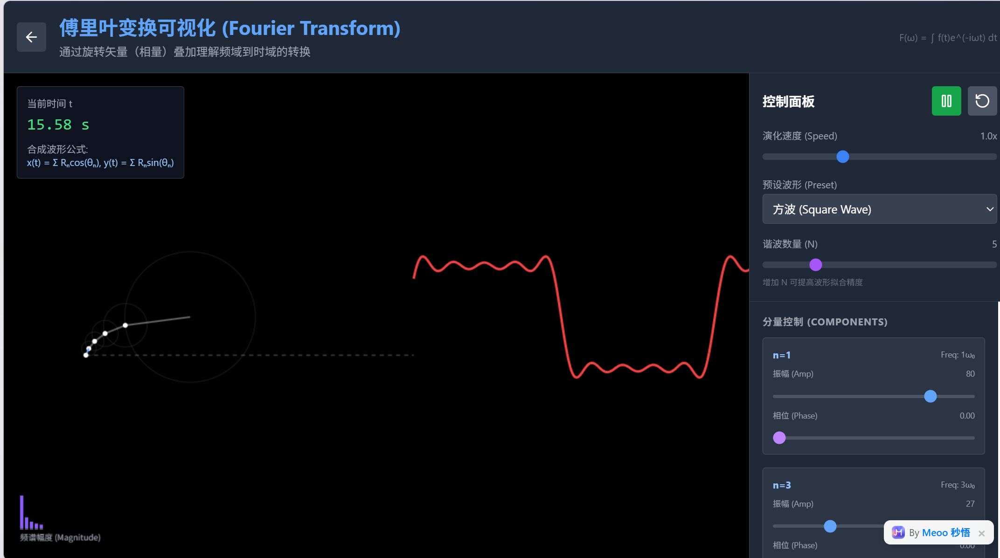
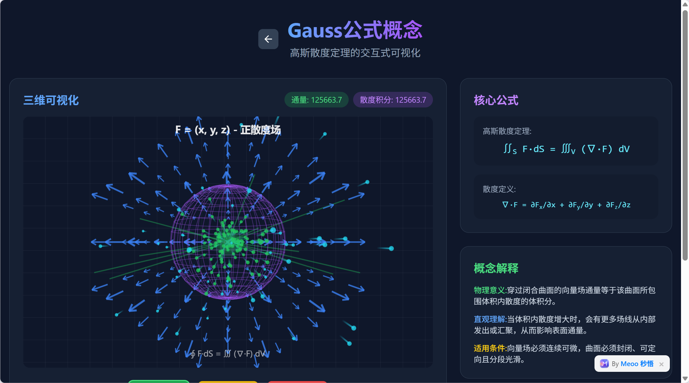

# MathViz


**将数学与科学概念转化为交互式动画可视化页面。**

输入一个概念名称（如 "Simple Harmonic Motion"），AI 自动生成带动画和交互功能的 HTML 页面，支持 KaTeX 数学公式渲染。

> Language / 语言: **[中文](#快速开始)** | **[English](#quick-start)**

---

## 快速开始

### 环境要求

- Node.js 18+
- pnpm（推荐）或 npm / yarn

### 安装与运行

```bash
git clone https://github.com/your-username/mathviz.git
cd mathviz
pnpm install
pnpm dev
```

打开 http://localhost:3000 即可使用。

### 环境变量（可选）

创建 `.env.local` 配置服务端 API Key（也可在 UI 界面中直接配置）：

```env
OPENAI_API_KEY=sk-your-key
OPENAI_BASE_URL=https://api.openai.com/v1
OPENAI_MODELS=gpt-4o,gpt-4o-mini
DEFAULT_MODEL=openai:gpt-4o
```

## 使用方式



1. 在页面输入 **Concept Name**（必填）
2. 选择 AI 服务商与模型（OpenAI / Anthropic / Google / DeepSeek / 自定义）
3. 填写 API Key
4. 点击"生成网页"
5. 右侧预览，点击"下载 HTML" 导出



可选参数：Subject、Concept Overview、Design Idea、Key Points、Language。

## 技术栈

| 类别 | 技术 |
|------|------|
| 框架 | Next.js 16 (App Router) |
| 前端 | React 19, TypeScript 5 |
| UI | Radix UI, shadcn/ui, Tailwind CSS 4 |
| AI | @ai-sdk/openai, @ai-sdk/anthropic, @ai-sdk/google |
| 状态管理 | Zustand |
| 国际化 | i18next (中文 / English) |
| 测试 | Vitest |

## 项目结构

```
.
├── app/                        # Next.js App Router
│   ├── api/
│   │   ├── interactive/        # 核心生成 API
│   │   │   ├── generate/       # SSE 流式生成
│   │   │   ├── validate/       # HTML 质量验证
│   │   │   └── post-process/   # KaTeX 注入与后处理
│   │   ├── server-providers/   # 服务端 Provider 配置
│   │   └── verify-model/       # 模型连接验证
│   └── interactive-agent/      # 主交互页面
├── components/                 # React 组件
│   ├── settings/               # 设置面板
│   └── ui/                     # 基础 UI 组件 (shadcn/ui)
├── lib/
│   ├── ai/                     # AI Provider 注册表
│   ├── interactive/            # 核心生成逻辑
│   ├── server/                 # 服务端工具
│   ├── store/                  # Zustand 状态管理
│   ├── i18n/                   # 国际化 (中/英)
│   └── utils/                  # 工具函数
└── tests/                      # 单元测试
```

## API 接口

### `POST /api/interactive/generate`

生成交互式动画 HTML 页面（SSE 流式响应）。

```json
{
  "conceptName": "Simple Harmonic Motion",
  "model": {
    "providerId": "openai",
    "model": "gpt-4o",
    "apiKey": "sk-xxx",
    "baseUrl": "https://api.openai.com/v1",
    "requiresApiKey": true
  }
}
```

### `POST /api/interactive/validate`

验证 HTML 内容质量。

### `POST /api/interactive/post-process`

后处理 HTML（注入 KaTeX、修正 LaTeX 分隔符等）。

## 质量保障

1. **AI 生成** — 使用 LLM 将概念建模为科学可视化
2. **HTML 验证** — 检查生成内容的结构完整性
3. **自动修复** — 验证失败时自动触发一次修复重写
4. **后处理** — 自动注入 KaTeX 渲染与 LaTeX 语法修正

## 构建与部署

```bash
# 开发
pnpm dev

# 生产构建
pnpm build
pnpm start

# 代码检查
pnpm lint

# 运行测试
pnpm test
```

## 许可证

[MIT](./LICENSE)

---

# Quick Start

## Requirements

- Node.js 18+
- pnpm (recommended) or npm / yarn

## Installation

```bash
git clone https://github.com/your-username/mathviz.git
cd mathviz
pnpm install
pnpm dev
```

Open http://localhost:3000 to get started.

## Environment Variables (Optional)

Create `.env.local` to configure server-side API keys (or configure directly in the UI):

```env
OPENAI_API_KEY=sk-your-key
OPENAI_BASE_URL=https://api.openai.com/v1
OPENAI_MODELS=gpt-4o,gpt-4o-mini
DEFAULT_MODEL=openai:gpt-4o
```

## Usage

1. Enter a **Concept Name** (required) — e.g. "Fourier Transform"
2. Select an AI provider and model
3. Enter your API Key
4. Click "Generate"
5. Preview and download the generated HTML

Optional parameters: Subject, Concept Overview, Design Idea, Key Points, Language.

## Quality Pipeline

1. **AI Generation** — LLM models concepts as scientific visualizations
2. **HTML Validation** — Structural integrity check
3. **Auto-Repair** — One-shot repair loop on validation failure
4. **Post-Processing** — KaTeX injection and LaTeX syntax correction

## License

[MIT](./LICENSE)
